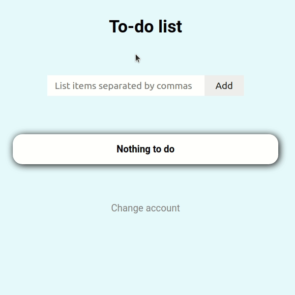
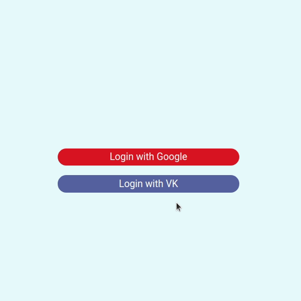

# To-do list

To-do list realisation using Django. You can [try it yourself](https://ilshat-to-do.herokuapp.com/items/).

<div align="center">
  
</div>

Introduction
============

This app allows you to maintain your to-do list. All you need is to authenticate using your social account (google and vk available).

<div align="center">
  
</div>

Instalation
===========
1. Clone git repo
    ```sh
    $ git clone https://github.com/ilshat25/to-do-list.git
    ```
2. Install all requirements from requirements.txt file (use virtual environment)
    ```sh
    $ pip install -r requirements.txt
    ```
3. Say django what settings file to use
    ```sh
    $ export DJANGO_SETTINGS_MODULE="toDoList.settings.local"
    ```
4. Use django secrete key. You can generate one on [this site](https://djecrety.ir/)
    ```sh
    $ export DJANGO_SECRET_KEY="Yours secret key"
    ```
5. Apply all migrations
    ```sh
    $ python manage.py migrate
    ```
6. Start your server
    ```sh
    $ python manage.py runserver
    ```
